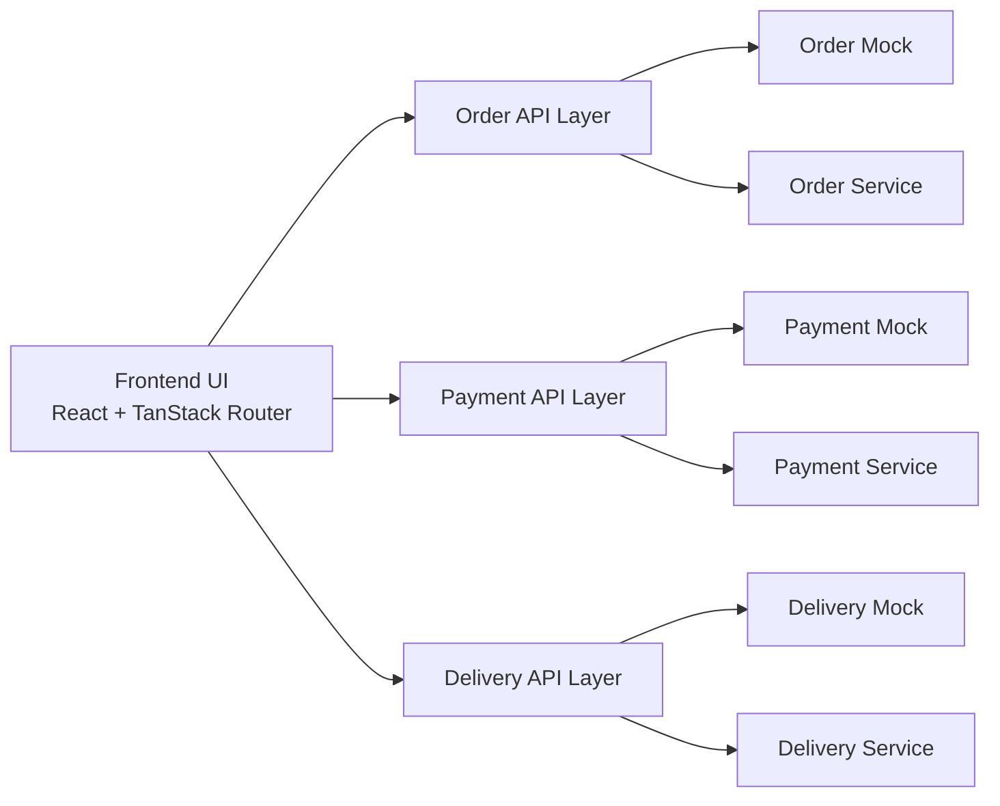

# Chau Ngoc Thao Web FE

A microservice-ready frontend for an online food ordering system built around three core domains:

- `Order`
- `Payment`
- `Delivery`

This project is designed for a Microservices course project where the frontend must stay clean, modular, and easy to connect to real backend services later.

## Overview

The application currently supports two runtime modes:

- `mock mode`: the frontend runs without real backend services
- `live mode`: the frontend sends HTTP requests to real backend microservices

The UI always talks to the same API layer. That means when backend services are ready, the team only needs to update API integration details instead of rewriting pages and components.

## Architecture



### Key design decisions

- Components do not call backend services directly.
- Pages do not own business logic for order processing.
- Each domain has its own API entry point.
- Mock implementations and live implementations are separated cleanly.
- Switching to a real backend should only require changes in the API layer and environment variables.

## Request Flow

### Checkout flow

1. The user selects products and opens the checkout page.
2. The frontend calls `createOrder()`.
3. The frontend calls `processPayment()`.
4. If payment succeeds, the frontend calls `triggerDelivery()`.
5. The user is redirected to the order tracking page.

### Tracking flow

1. The frontend reads `orderId` from the route.
2. The frontend loads order data through the Order API layer.
3. The UI renders the current order status and activity timeline.
4. Delivery and payment information are shown as part of the order lifecycle.

## Project Structure

```text
src/
  components/
    DemoControlPanel.tsx
    MenuGrid.tsx
    OrderTracker.tsx
    QuickCart.tsx
    SiteFooter.tsx
    SiteHeader.tsx
  hooks/
  lib/
    cart.ts
    menu.ts
    utils.ts
  mocks/
    db.ts
  routes/
    __root.tsx
    index.tsx
    menu.tsx
    checkout.tsx
    track.tsx
    order.$orderId.tsx
  services/
    order/
      order.api.ts
      order.mock.ts
    payment/
      payment.api.ts
      payment.mock.ts
    delivery/
      delivery.api.ts
      delivery.mock.ts
  shared/
    config.ts
    http.ts
    order.types.ts
```

## Service Layer Design

### Order domain

Files:

- [order.api.ts](/D:/ChauNgocThao-Web_FE/src/services/order/order.api.ts)
- [order.mock.ts](/D:/ChauNgocThao-Web_FE/src/services/order/order.mock.ts)

Main responsibilities:

- create orders
- fetch one order
- fetch all orders
- subscribe to order updates in mock mode
- manually advance status for demo purposes

### Payment domain

Files:

- [payment.api.ts](/D:/ChauNgocThao-Web_FE/src/services/payment/payment.api.ts)
- [payment.mock.ts](/D:/ChauNgocThao-Web_FE/src/services/payment/payment.mock.ts)

Main responsibilities:

- process payment
- get payment information
- simulate payment outcome in demo mode

### Delivery domain

Files:

- [delivery.api.ts](/D:/ChauNgocThao-Web_FE/src/services/delivery/delivery.api.ts)
- [delivery.mock.ts](/D:/ChauNgocThao-Web_FE/src/services/delivery/delivery.mock.ts)

Main responsibilities:

- trigger delivery
- get delivery information
- mark delivery as completed

## Runtime Modes

### Mock mode

In mock mode:

- the frontend does not call real backend services
- data is stored in [db.ts](/D:/ChauNgocThao-Web_FE/src/mocks/db.ts)
- the app is suitable for UI demos and backend-independent development

### Live mode

In live mode:

- the frontend calls real HTTP endpoints
- service URLs are controlled by environment variables
- the UI and route layer remain mostly unchanged

## Environment Configuration

Environment file example:

- [.env.example](/D:/ChauNgocThao-Web_FE/.env.example)

```env
VITE_API_MODE=mock
VITE_ORDER_SERVICE_URL=http://localhost:8081
VITE_PAYMENT_SERVICE_URL=http://localhost:8082
VITE_DELIVERY_SERVICE_URL=http://localhost:8083
```

### Variables

- `VITE_API_MODE`: `mock` or `live`
- `VITE_ORDER_SERVICE_URL`: base URL of the Order Service
- `VITE_PAYMENT_SERVICE_URL`: base URL of the Payment Service
- `VITE_DELIVERY_SERVICE_URL`: base URL of the Delivery Service

## Recommended Backend API Contract

The current frontend is already prepared around this contract.

### Order Service

Base URL:

```text
http://localhost:8081
```

Endpoints:

- `POST /orders`
- `GET /orders`
- `GET /orders/:orderId`
- `PATCH /orders/:orderId/status`

### Payment Service

Base URL:

```text
http://localhost:8082
```

Endpoints:

- `POST /payments`
- `GET /payments/:orderId`

### Delivery Service

Base URL:

```text
http://localhost:8083
```

Endpoints:

- `POST /deliveries`
- `GET /deliveries/:orderId`
- `PATCH /deliveries/:orderId/delivered`

For the detailed request and response contract, see [API-CONTRACT.md](/D:/ChauNgocThao-Web_FE/API-CONTRACT.md).

## Shared Data Model

Core types are defined in [order.types.ts](/D:/ChauNgocThao-Web_FE/src/shared/order.types.ts).

### Order status

```text
PENDING_PAYMENT
CONFIRMED
DELIVERING
DELIVERED
CANCELLED
```

### Payment method

```text
card
ewallet
cod
```

### Payment status

```text
PENDING
SUCCESS
FAILED
```

## Route Responsibilities

### `/`

Landing page:

- brand presentation
- featured items
- navigation to menu and tracking

### `/menu`

Menu page:

- display products
- add products to cart

### `/checkout`

Checkout page:

- collect customer information
- select payment method
- create order
- process payment
- trigger delivery

### `/track`

Tracking entry page:

- search by order ID
- view recent orders

### `/order/$orderId`

Detailed order page:

- order status timeline
- service activity log
- delivery details
- demo control panel

## Getting Started

### Install dependencies

```bash
npm install
```

### Run development server

```bash
npm run dev
```

### Build production bundle

```bash
npm run build
```

### Run lint

```bash
npm run lint
```

## Connecting Real Backend Services Later

When the backend team is ready, the migration path is straightforward:

1. Create a local `.env` file.
2. Set `VITE_API_MODE=live`.
3. Update service URLs.
4. Ensure backend responses match the agreed contract.
5. If a backend endpoint differs, update only the API layer:
   - [order.api.ts](/D:/ChauNgocThao-Web_FE/src/services/order/order.api.ts)
   - [payment.api.ts](/D:/ChauNgocThao-Web_FE/src/services/payment/payment.api.ts)
   - [delivery.api.ts](/D:/ChauNgocThao-Web_FE/src/services/delivery/delivery.api.ts)

This keeps:

- routes stable
- components reusable
- domain boundaries clear

## Recommended Next Improvements

- Introduce React Query for better server-state handling.
- Split request DTOs and response DTOs per service.
- Add better error-state handling for unavailable services.
- Add authentication if the system later supports user accounts.
- Introduce an API Gateway if the team wants a single backend entry point.
- Publish an OpenAPI or Swagger document for backend coordination.

## Current Status

At the moment, the project already:

- separates frontend responsibilities by domain
- supports both mock mode and live mode
- is ready for backend integration
- builds successfully
- passes lint except for one minor Fast Refresh warning in [router.tsx](/D:/ChauNgocThao-Web_FE/src/router.tsx)

## Academic Note

In a proper microservice architecture:

- the frontend should not connect directly to databases
- each service should own its own database
- the frontend should communicate through APIs only

That means the intended architecture is:

```text
Frontend
  -> Order Service -> Order DB
  -> Payment Service -> Payment DB
  -> Delivery Service -> Delivery DB
```

This frontend is structured to align with that model.
