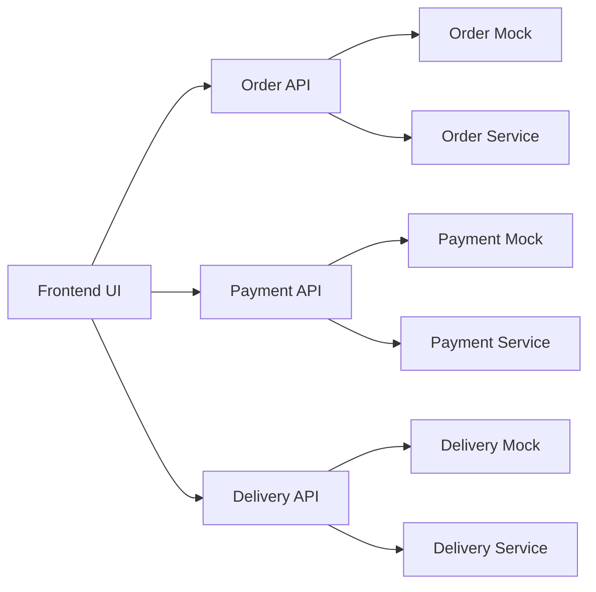

# Chau Ngoc Thao Web FE

Frontend for a food ordering platform designed around three core microservice domains: `Order`, `Payment`, and `Delivery`.

This repository is structured as a **microservice-ready frontend**. It can run independently in mock mode today and switch to real backend services later with minimal code changes.

---

## Executive Summary

| Area | Description |
| --- | --- |
| Frontend stack | React, TypeScript, Vite, TanStack Router |
| Service domains | Order, Payment, Delivery |
| Current integration mode | Mock and Live |
| Backend strategy | Frontend talks to domain API layers, not databases |
| Migration path | Replace mock-backed API calls with real service endpoints |

---

## Architecture



### Design Principles

| Principle | Implementation |
| --- | --- |
| Clear domain boundaries | `order`, `payment`, and `delivery` are split into separate service folders |
| Stable UI layer | Pages and components consume API modules instead of direct business logic |
| Backend-independent development | Mock implementations allow end-to-end UI work before backend exists |
| Low-friction backend integration | Switching to live services is controlled by environment variables |

---

## Frontend to Backend Flow

### Checkout

1. User reviews the cart and enters delivery information.
2. Frontend calls `createOrder()`.
3. Frontend calls `processPayment()`.
4. If payment succeeds, frontend calls `triggerDelivery()`.
5. User is redirected to `/order/$orderId`.

### Tracking

1. Frontend reads `orderId` from the route.
2. Frontend loads order information through the Order API layer.
3. The UI renders order status, payment progress, and delivery updates.

---

## Repository Structure

```text
src/
  components/
    DemoControlPanel.tsx
    MenuGrid.tsx
    OrderTracker.tsx
    QuickCart.tsx
    SiteFooter.tsx
    SiteHeader.tsx
  hooks/
  lib/
    cart.ts
    menu.ts
    utils.ts
  mocks/
    db.ts
  routes/
    __root.tsx
    index.tsx
    menu.tsx
    checkout.tsx
    track.tsx
    order.$orderId.tsx
  services/
    order/
      order.api.ts
      order.mock.ts
    payment/
      payment.api.ts
      payment.mock.ts
    delivery/
      delivery.api.ts
      delivery.mock.ts
  shared/
    config.ts
    http.ts
    order.types.ts
```

---

## Service Layer

### Order

| File | Role |
| --- | --- |
| [order.api.ts](/D:/ChauNgocThao-Web_FE/src/services/order/order.api.ts) | Public API entry for the Order domain |
| [order.mock.ts](/D:/ChauNgocThao-Web_FE/src/services/order/order.mock.ts) | Mock implementation used in mock mode |

Primary responsibilities:

- create orders
- fetch one order or many orders
- subscribe to order updates in mock mode
- manually advance status for demo scenarios

### Payment

| File | Role |
| --- | --- |
| [payment.api.ts](/D:/ChauNgocThao-Web_FE/src/services/payment/payment.api.ts) | Public API entry for the Payment domain |
| [payment.mock.ts](/D:/ChauNgocThao-Web_FE/src/services/payment/payment.mock.ts) | Mock implementation used in mock mode |

Primary responsibilities:

- process payment
- fetch payment information
- simulate payment outcomes for demos

### Delivery

| File | Role |
| --- | --- |
| [delivery.api.ts](/D:/ChauNgocThao-Web_FE/src/services/delivery/delivery.api.ts) | Public API entry for the Delivery domain |
| [delivery.mock.ts](/D:/ChauNgocThao-Web_FE/src/services/delivery/delivery.mock.ts) | Mock implementation used in mock mode |

Primary responsibilities:

- trigger delivery
- fetch delivery information
- mark delivery as completed

---

## Runtime Modes

| Mode | Purpose | Data source |
| --- | --- | --- |
| `mock` | UI development and demo without backend | Local mock implementations |
| `live` | Real backend integration | HTTP calls to microservices |

Configuration is controlled by [config.ts](/D:/ChauNgocThao-Web_FE/src/shared/config.ts).

---

## Environment Configuration

Example file:

- [.env.example](/D:/ChauNgocThao-Web_FE/.env.example)

```env
VITE_API_MODE=mock
VITE_ORDER_SERVICE_URL=http://localhost:8081
VITE_PAYMENT_SERVICE_URL=http://localhost:8082
VITE_DELIVERY_SERVICE_URL=http://localhost:8083
```

### Variables

| Variable | Meaning |
| --- | --- |
| `VITE_API_MODE` | `mock` or `live` |
| `VITE_ORDER_SERVICE_URL` | Base URL of Order Service |
| `VITE_PAYMENT_SERVICE_URL` | Base URL of Payment Service |
| `VITE_DELIVERY_SERVICE_URL` | Base URL of Delivery Service |

---

## Backend Contract

The frontend is already aligned with the following service boundaries:

| Service | Base URL | Key endpoints |
| --- | --- | --- |
| Order | `http://localhost:8081` | `POST /orders`, `GET /orders`, `GET /orders/:orderId`, `PATCH /orders/:orderId/status` |
| Payment | `http://localhost:8082` | `POST /payments`, `GET /payments/:orderId` |
| Delivery | `http://localhost:8083` | `POST /deliveries`, `GET /deliveries/:orderId`, `PATCH /deliveries/:orderId/delivered` |

Detailed request and response examples are documented in [API-CONTRACT.md](/D:/ChauNgocThao-Web_FE/API-CONTRACT.md).

---

## Shared Domain Model

Core shared types are defined in [order.types.ts](/D:/ChauNgocThao-Web_FE/src/shared/order.types.ts).

### Order Status

```text
PENDING_PAYMENT
CONFIRMED
DELIVERING
DELIVERED
CANCELLED
```

### Payment Method

```text
card
ewallet
cod
```

### Payment Status

```text
PENDING
SUCCESS
FAILED
```

---

## Route Map

| Route | Responsibility |
| --- | --- |
| `/` | Landing page, featured products, primary navigation |
| `/menu` | Product browsing and add-to-cart flow |
| `/checkout` | Customer details, payment selection, order creation |
| `/track` | Order lookup and recent order access |
| `/order/$orderId` | Detailed order tracking and service activity log |

---

## Getting Started

### Install dependencies

```bash
npm install
```

### Run locally

```bash
npm run dev
```

### Build

```bash
npm run build
```

### Lint

```bash
npm run lint
```

---

## Real Backend Integration Plan

When backend services are ready:

1. Create a local `.env`.
2. Set `VITE_API_MODE=live`.
3. Configure the real service URLs.
4. Confirm backend responses follow the agreed contract.
5. If a contract differs, update only the API layer:
   - [order.api.ts](/D:/ChauNgocThao-Web_FE/src/services/order/order.api.ts)
   - [payment.api.ts](/D:/ChauNgocThao-Web_FE/src/services/payment/payment.api.ts)
   - [delivery.api.ts](/D:/ChauNgocThao-Web_FE/src/services/delivery/delivery.api.ts)

This keeps the route layer and component layer stable.

---

## Roadmap

- Add React Query for server-state management
- Introduce request and response DTOs per service
- Improve error handling and retry strategies
- Add authentication if user accounts are introduced
- Add an API Gateway if the team moves to a single backend entry point
- Publish OpenAPI documentation for service contracts

---

## Current Project Status

| Checkpoint | Status |
| --- | --- |
| Domain separation | Complete |
| Mock mode | Complete |
| Live mode wiring | Complete |
| Backend-ready API layer | Complete |
| Production build | Passing |
| Lint | Passing with one minor Fast Refresh warning in [router.tsx](/D:/ChauNgocThao-Web_FE/src/router.tsx) |

---

## Microservice Note

In a proper microservice architecture:

- the frontend does not connect directly to databases
- each service owns its own database
- the frontend communicates through APIs only

Target architecture:

```text
Frontend
  -> Order Service -> Order DB
  -> Payment Service -> Payment DB
  -> Delivery Service -> Delivery DB
```

This frontend is intentionally structured to support that architecture.
